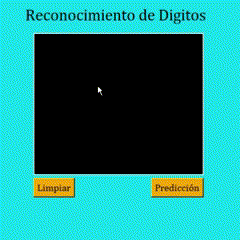

# Digit Recognizer



En este repositorio encontrará la documentación y códigos relacionados con la solución de los problemas, implementaciones y conclusiones del proyecto. Esta propuesta fue desarrollada para "Introducción a la Inteligencia Artificial" (Universidad Nacional de Colombia).

# Directorio

* El reporte escrito y el Jupyter Notebook con los resultados están ubicados en la carpeta `/docs`.
* Los modelos obtenidos están almacenados en `src/models`.
* El principal ejecutable `GUI.py` se encuentra en la carpeta `/src`. El script para entrenar modelos está en `train_model.py`, ubicado en la misma carpeta.

# Instalación y Dependencias

Como requisito general, es obligatorio tener **`Python 3.10.0`** instalado.

Después de clonar este repositorio y entrar en el directorio, siga estos pasos:

En el directorio principal, abra un terminal y ejecute:

```pip install -r requirements.txt```

Después, abra la carpeta `src/` y ejecute:

```python GUI.py```

## Contacto

Este repositorio ha sido desarrollado por [Juan Pablo Urrutia](https://github.com/jurrutiap), [Juan David Bernal Vesga](https://github.com/JuanDavinXI) y [Oscar David Ordóñez Bolaños](https://github.com/Odob13). Cualquier pregunta, por favor no dude en contactarse.
